---
Storage Management
---

# Magnetic Disk

## Transfer Time

## Positioning time

## Random access time

## Seek time 

젤 느림

앞뒤로 움직이며 원하는 track 찾기

## Rotational latency

원하는 sector 위에 오게됨

헤드로부터 데이터 읽힘 => **Data Transfer**

# Solid State Disk

비휘발성

움직이는 부분 x => seek time, latency 없음 => faster


## RAID

여러개의 디스크를 묶어 하나의 디스크처럼 사용하는 기술

```diff
+ 대용량의 단일 볼륨 사용하는 효과
+ 디스크 I/O 병렬화 => 성능 향상
+ 데이터 복제 => 안정성
```


## File Control Block (information-node)

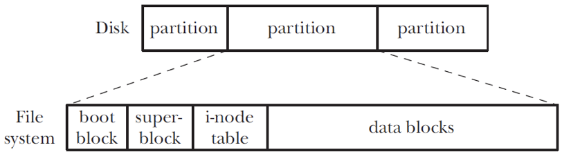

* **Boot block** : 시작 블록
* **Super Block** : 그다음 블록 ( i-node table.size, file system.size in logical block ) **Volume Control**
* **I-node Table** : + file name => Directory structure
* Data Block : block holding actual data

# File System

## File control block (i-node)

하나 파일당 하나의 아이노드

- file type (regular, directory, symbolic link, char dev)

- owner, group

- access permission for owner, group and other

- time stamps: last access, modification, status change time (i-node change), BUT no creation time

- Num of hard links to the file

* size of file in bytes

*  num of blocks allocated to the file

* pointers to the data blocks

## Directory

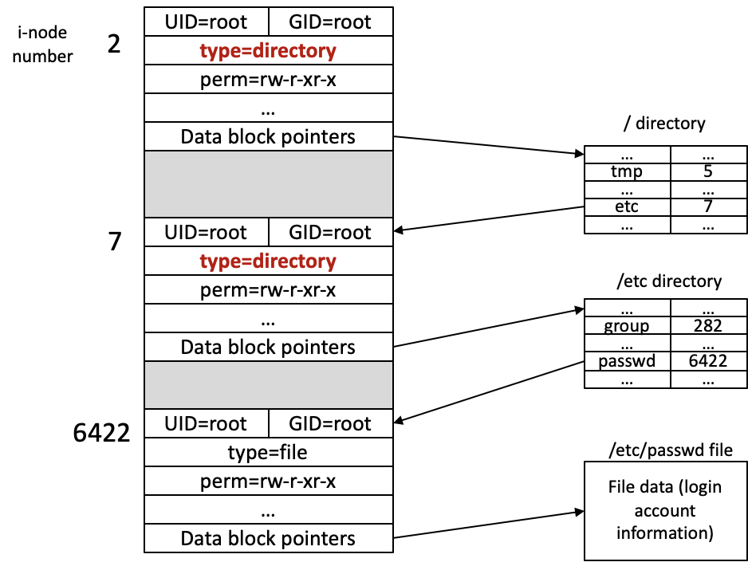


## Mounting

사용전에 파일시스템은 mount 되어야한다.

## Implementation


# Virtual File system

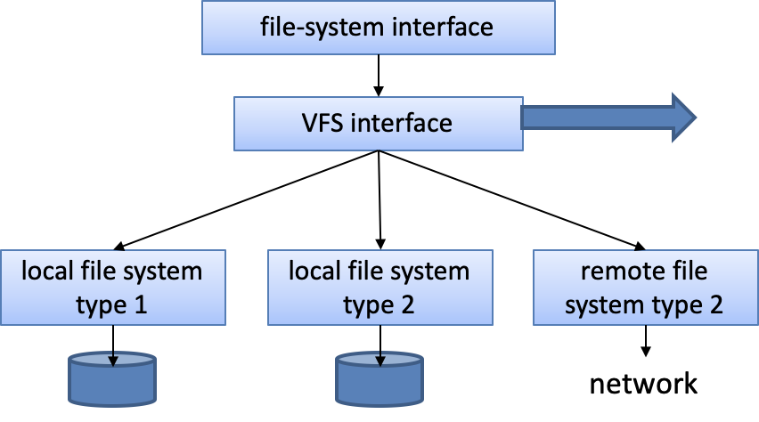


## Disk Block Allocation

Allocate to disk blocks to files

- ### Contiguous

  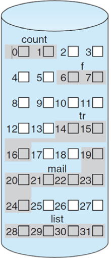

  ```diff
  -external fragmentation => compaction
  + # of disk seek 적다
  ```

- ### linked

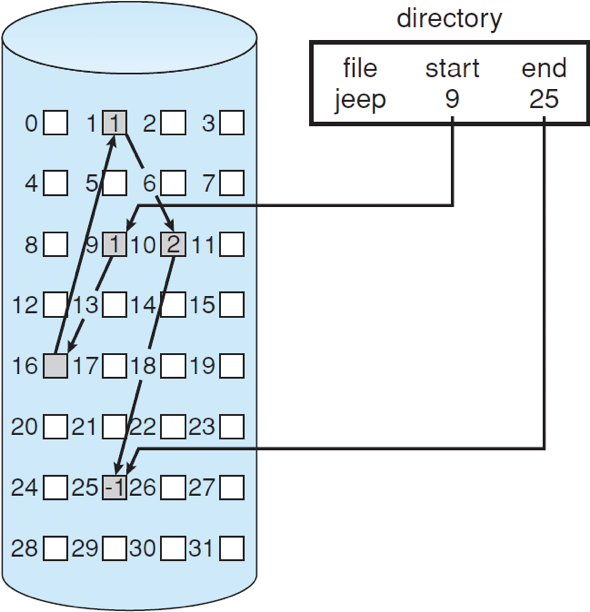

- ### Indexed 

  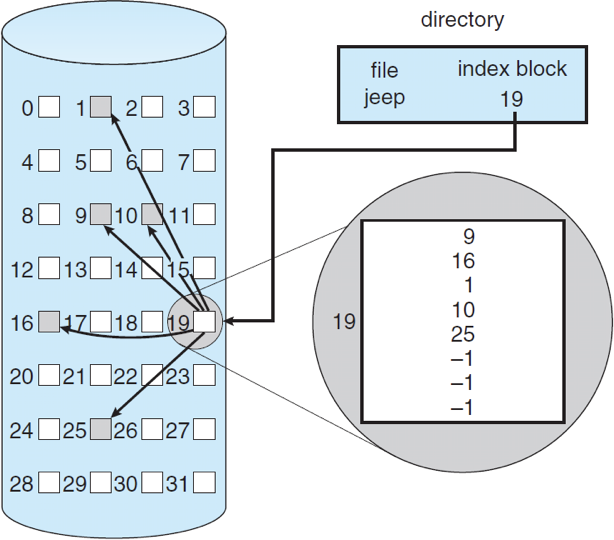

# Disk Scheduling

```diff
+ disk I/O latencies 줄어든다
```


## FCFS(first-come, first-serviced algorithm)

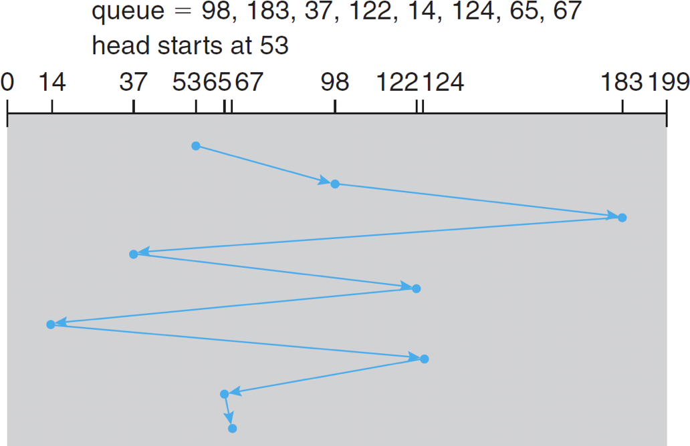

## SSTF(Shortest-seek-time-first algorithm)

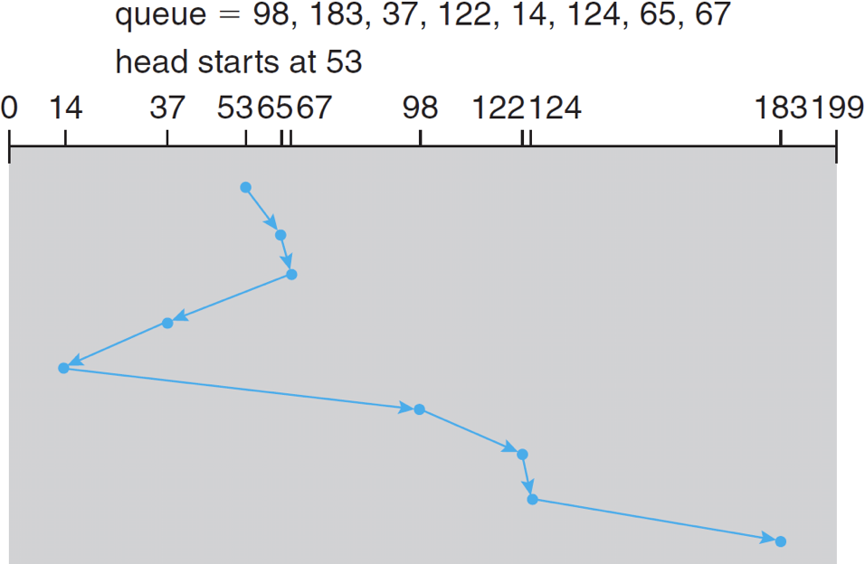

```diff
- Starvation
- not optimal
```

## SCAN

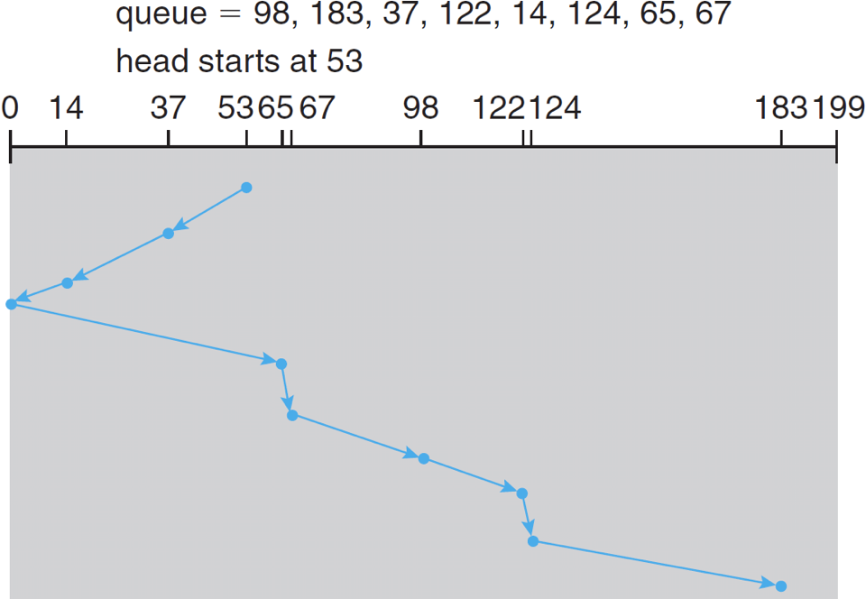

## C-SCAN (Circular SCAN)

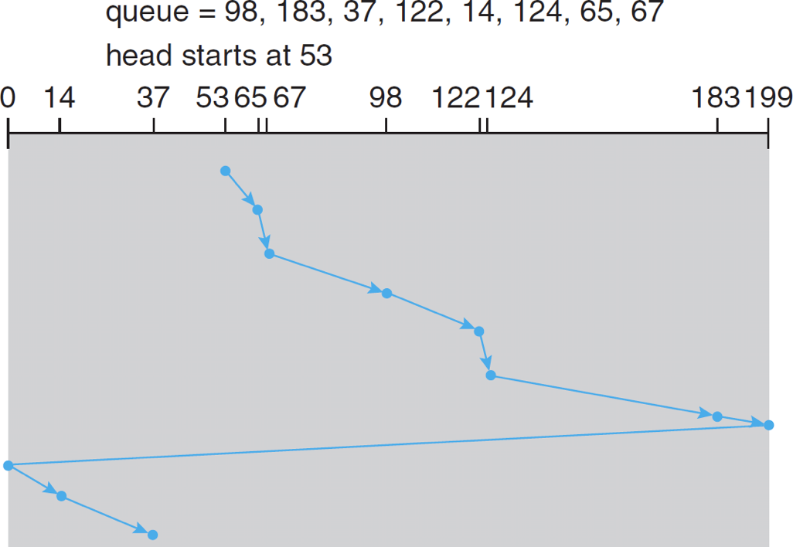

## LOOK

•Disk arm changes direction before reaching the end

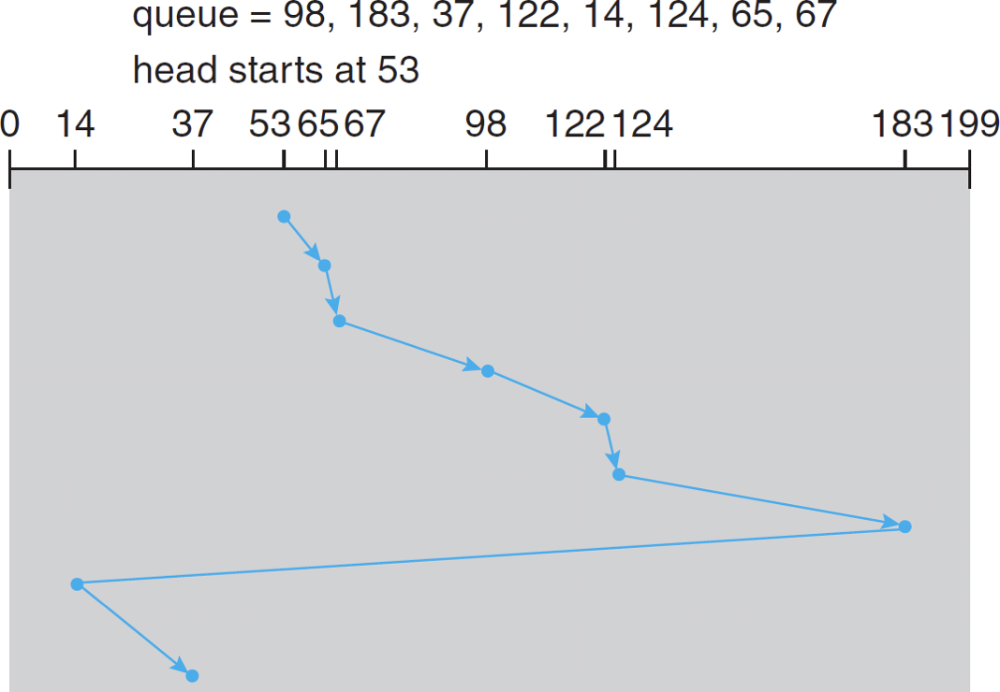

